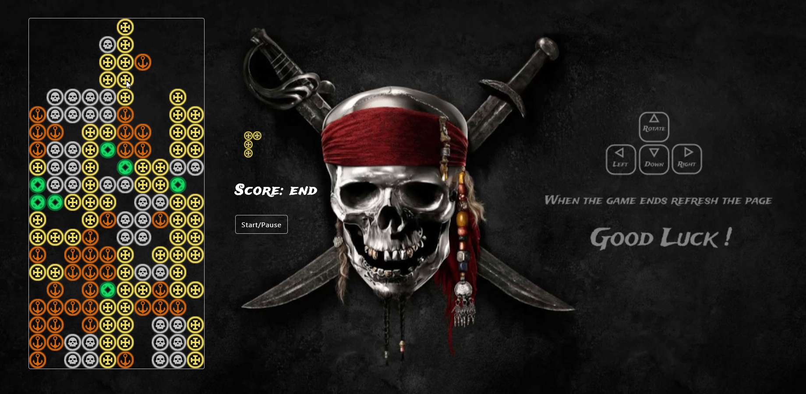

# Tetris Javascript Game
This is a version of Basic Tetris Game, created by following a tutorial by Ania Kubow. Background is from the free source. I draw all SVG icons in Adobe Illustrator.
Code is from here [https://github.com/kubowania/Tetris-Basic](https://github.com/kubowania/Tetris-Basic)

